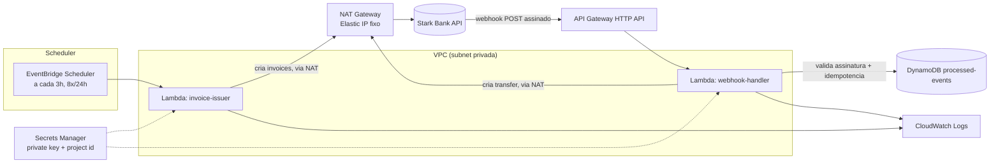

# Design — Arquitetura Técnica

## 1. Visão geral



Arquitetura 100% serverless: escolhida em vez de um container de longa duração (ex.: FastAPI + APScheduler em Fargate/EC2) porque a carga é esporádica — 8 disparos agendados em 24h e um volume baixo de webhooks. Serverless elimina custo de infraestrutura ociosa, cabe no free tier da AWS e reduz a superfície de operação (sem patch de SO, sem gerenciamento de processo).

## 2. Componentes

### 2.1 Lambda `invoice-issuer` (atende RF1)

- **Trigger**: EventBridge Scheduler, expressão `rate(3 hours)` dentro de uma schedule group com `startDate`/`endDate` limitando a janela de 24h (garante exatamente 8 execuções sem precisar de lógica extra de contagem).
- **Design (SRP)**: a lógica é dividida em duas classes de responsabilidade única:
  - `UniquePersonGenerator`: só gera pessoas fictícias (nome + taxID válido + valor), garantindo taxIDs distintos dentro do lote (RF1.2).
  - `InvoiceBatchIssuer`: só orquestra a criação do lote — chama `starkbank.invoice.create` por pessoa, isola falhas individuais (RF1.5) e agrega o resultado.
  - `handler()` fica reduzido a "obter o Project, sortear o tamanho do lote, montar as duas peças acima e delegar" — sem lógica de negócio própria.
- **Resiliência**: cada invoice é criada dentro de seu próprio try/except (`InvoiceBatchIssuer._issue_one`); falha em uma não aborta o lote.
- **Config**: timeout 30s, memória 128MB (lote pequeno, sem processamento pesado).

### 2.2 API Gateway (HTTP API) + Lambda `webhook-handler` (atende RF2, RF3)

- Endpoint público HTTPS único: `POST /webhook`.
- **Design (SRP + DIP)**: a lógica é dividida em duas classes, e `handler()` só orquestra:
  - `ProcessedEventRepository`: único ponto de acesso ao DynamoDB, expõe `try_claim`/`mark_completed`/`mark_failed` — ver seção 4 para as garantias ACID por trás desses métodos.
  - `CreditSettlementService`: única responsável por transformar um `invoice.Log` "credited" numa Transfer (calcula `amount - fee`, chama `starkbank.transfer.create`).
- Fluxo do handler:
  1. Lê corpo bruto da requisição e o header `Digital-Signature`.
  2. Chama `starkbank.event.parse(content, signature)` — o próprio SDK valida a assinatura contra a chave pública da Stark Bank (com cache interno).
  3. Se a assinatura falhar, o SDK lança exceção → handler responde 400 sem processar.
  4. Se `event.subscription == "invoice"` e o log for do tipo "credited" (`_is_credited_invoice`): segue; senão retorna 200 "ignored" imediatamente, sem gravar nada.
  5. `ProcessedEventRepository.try_claim` grava `event.id` no DynamoDB com **escrita condicional**. Se retornar `False`, o evento já foi processado → responde 200 e não faz nada mais.
  6. `CreditSettlementService.settle` calcula `amount - fee` e cria a Transfer via `starkbank.transfer.create` para a conta destino fixa.
  7. `ProcessedEventRepository.mark_completed`/`mark_failed` atualiza o registro no DynamoDB com o resultado.

### 2.3 DynamoDB `processed-events`

- PK: `event_id` (string).
- Atributos: `status` (`completed`/`failed`), `transfer_id`, `processed_at`.
- TTL habilitado (ex.: 30 dias) para limpeza automática — não há necessidade de retenção indefinida.
- Billing mode: on-demand (pay-per-request), sem custo fixo e dentro do free tier para o volume esperado.

### 2.4 Secrets Manager

- Um secret único `starkbank/credentials` com `private_key` (PEM) e `project_id`.
- Cada Lambda acessa via IAM role restrita ao ARN exato do secret (least privilege).
- O secret é populado manualmente após a criação do Project na Stark Bank (passo fora do CDK — ver tasks.md).

### 2.5 IAM

- Uma role por Lambda, cada uma com apenas as permissões que usa: `secretsmanager:GetSecretValue` no secret específico, `dynamodb:GetItem`/`PutItem`/`UpdateItem` na tabela específica (só para `webhook-handler`), e permissões padrão de CloudWatch Logs.

### 2.6 VPC + NAT Gateway (IP fixo)

Não previsto na versão original deste documento — adicionado depois que o deploy real revelou que a Stark Bank **exige pelo menos um IP cadastrado em "IPs permitidos" por Project**, obrigatório na interface do dashboard mesmo sendo tecnicamente opcional no SDK (`Project.allowed_ips=None` por padrão). Como o IP de saída padrão de uma Lambda fora de VPC é dinâmico (alocado de um pool gerenciado pela AWS, muda entre invocações), não dava para cadastrar um IP estável sem essa mudança.

- As duas Lambdas rodam em subnets privadas de uma VPC (`max_azs=1`, 1 subnet pública + 1 privada).
- Um único **NAT Gateway** com **Elastic IP** fixo concentra todo o tráfego de saída; esse IP é exposto como output do CDK (`NatGatewayIp`) e precisa ser cadastrado manualmente no dashboard da Stark Bank.
- **DynamoDB Gateway Endpoint** adicionado à VPC para que o `webhook-handler` acesse a tabela sem depender do NAT (tráfego de/para a AWS não precisa sair para a internet, e o endpoint de gateway não tem custo).
- Secrets Manager continua sendo acessado via NAT (volume de tráfego irrelevante, não justifica um Interface Endpoint adicional só para isso).
- **Custo**: essa é a única peça da arquitetura que não cabe inteiramente no "Always Free" da AWS — NAT Gateway cobra por hora + dados processados (~$0,045/h). Para o volume e duração desse desafio, o custo total fica na casa de poucos dólares; o NAT Gateway deve ser destruído (`cdk destroy`) assim que os testes terminarem.

## 3. Fluxo de dados

1. **Emissão**: EventBridge dispara `invoice-issuer` a cada 3h → SDK cria 8-12 invoices → o Sandbox simula o pagamento de parte delas automaticamente.
2. **Callback**: a Stark Bank envia um webhook assinado para o API Gateway quando uma invoice é creditada.
3. **Processamento**: `webhook-handler` valida a assinatura, verifica idempotência, calcula o valor líquido e cria a Transfer.
4. **Auditoria**: todo evento processado fica registrado no DynamoDB e nos logs do CloudWatch, permitindo reconstruir o histórico.

## 4. Tratamento de erros e idempotência

- **Reentrega de webhook**: a escrita condicional no DynamoDB antes da Transfer previne duplicidade mesmo sob reentregas concorrentes (a condição é avaliada atomicamente pelo DynamoDB).
- **Falha ao criar a Transfer**: o evento fica com `status=failed` no lugar de `completed`, e a condição de `try_claim` (`attribute_not_exists OR status <> completed`) permite que uma reentrega da Stark Bank tente de novo — não fica travado permanentemente.
- **Falha isolada na emissão de uma invoice**: não aborta o lote (try/except por invoice, ver RF1.5).

### 4.1 Propriedades ACID aplicadas à idempotência

O `ProcessedEventRepository` existe especificamente para dar essas garantias, todas apoiadas em operações de item único do DynamoDB (que são sempre atômicas):

| Propriedade | Onde se aplica |
|---|---|
| **Atomicity** | `try_claim` é um único `put_item` condicional: ou grava tudo (event_id + status + ttl) ou não grava nada — nunca fica um registro pela metade. |
| **Consistency** | A condição `attribute_not_exists(event_id) OR status <> completed` é o invariante do sistema: nenhum evento pode ter duas Transfers associadas. Isso é garantido pelo próprio banco, não só pela lógica da aplicação. |
| **Isolation** | DynamoDB serializa escritas concorrentes ao mesmo item — duas reentregas do mesmo webhook chegando ao mesmo tempo não conseguem as duas "ganhar" o `try_claim`. |
| **Durability** | Uma vez confirmado pelo DynamoDB, o registro sobrevive ao fim da execução da Lambda (memória efêmera) e a eventuais crashes. |

**Limite real desse desenho**: a Transfer (Stark Bank) e o registro de idempotência (DynamoDB) são dois sistemas independentes — não existe uma transação distribuída amarrando os dois. Se a Lambda morrer exatamente entre a Transfer ter sido criada com sucesso e o `mark_completed` ser gravado, uma reentrega veria o evento como `processing`/`failed` e tentaria de novo. Para não duplicar o pagamento nesse cenário raro, `CreditSettlementService.settle` passa `external_id=event_id` na Transfer: a Stark Bank rejeita qualquer segunda tentativa com o mesmo `external_id` em vez de mover o dinheiro de novo. A troca é deliberada: preferimos uma falha visível (que exige investigação manual) a uma duplicidade silenciosa de transferência.

## 5. Estrutura de projeto

```
starkbank-test/
├── specs/                      # requirements.md, design.md, tasks.md
├── infra/                      # AWS CDK app (Python)
│   ├── app.py
│   ├── cdk.json
│   ├── requirements.txt
│   └── stark_infra/
│       ├── stark_stack.py      # VPC, NAT Gateway, DynamoDB, Lambdas, Schedule, API Gateway
│       └── bundling.py         # empacotamento das Lambdas sem Docker
├── src/
│   ├── invoice_issuer/
│   │   └── handler.py
│   ├── webhook_handler/
│   │   └── handler.py
│   └── common/
│       ├── starkbank_client.py
│       └── random_person.py
├── tests/
│   ├── conftest.py
│   ├── test_starkbank_client.py
│   ├── test_random_person.py
│   ├── test_invoice_issuer_handler.py
│   └── test_webhook_handler.py
├── pytest.ini
├── requirements.txt
├── requirements-dev.txt
├── README.md
└── .gitignore
```

## 6. Decisões e alternativas consideradas

| Decisão | Escolha | Alternativa descartada | Motivo |
|---|---|---|---|
| Compute | Lambda | Fargate/EC2 com processo contínuo | Carga esporádica; serverless é mais barato e não exige gestão de processo/SO |
| Idempotência | DynamoDB (write condicional) | Arquivo/S3 | DynamoDB oferece escrita atômica condicional, evitando corrida entre reentregas concorrentes |
| Agendamento | EventBridge Scheduler | CloudWatch Events (rules) clássico | Serviço mais recente, com suporte nativo a `startDate`/`endDate` e "flexible time window", menos boilerplate |
| IaC | AWS CDK (Python) | SAM / Terraform / Console manual | Mesma linguagem da aplicação; infra testável e versionada junto do código |
| Rede (IP fixo) | VPC + NAT Gateway com Elastic IP | Lambda sem VPC (plano original) | Descartada na prática: a Stark Bank exige IP cadastrado por Project, e o IP de saída de uma Lambda sem VPC é dinâmico. NAT Gateway foi a opção mais simples de implementar com CDK, apesar de ser a única peça paga da arquitetura |
| Bundling das Lambdas | `pip install` local (sem Docker) | Docker via `aws_lambda_python_alpha` | `starkbank` e suas dependências são 100% Python puro (sem extensões compiladas), então build local funciona igual em qualquer SO e evita depender de Docker Desktop instalado |
