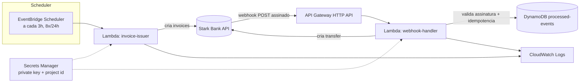

# Design — Arquitetura Técnica

## 1. Visão geral



Arquitetura 100% serverless: escolhida em vez de um container de longa duração (ex.: FastAPI + APScheduler em Fargate/EC2) porque a carga é esporádica — 8 disparos agendados em 24h e um volume baixo de webhooks. Serverless elimina custo de infraestrutura ociosa, cabe no free tier da AWS e reduz a superfície de operação (sem patch de SO, sem gerenciamento de processo).

## 2. Componentes

### 2.1 Lambda `invoice-issuer` (atende RF1)

- **Trigger**: EventBridge Scheduler, expressão `rate(3 hours)` dentro de uma schedule group com `startDate`/`endDate` limitando a janela de 24h (garante exatamente 8 execuções sem precisar de lógica extra de contagem).
- **Responsabilidade**: gerar N (sorteado entre 8 e 12) registros de pessoas fictícias (nome + taxID válido gerado por algoritmo de CPF) com valor aleatório dentro de uma faixa configurável via variável de ambiente, e chamar `starkbank.invoice.create` para cada um.
- **Resiliência**: cada invoice é criada dentro de seu próprio try/except; falha em uma não aborta o lote (RF1.5).
- **Config**: timeout 30s, memória 128MB (lote pequeno, sem processamento pesado).

### 2.2 API Gateway (HTTP API) + Lambda `webhook-handler` (atende RF2, RF3)

- Endpoint público HTTPS único: `POST /webhook`.
- Fluxo do handler:
  1. Lê corpo bruto da requisição e o header `Digital-Signature`.
  2. Chama `starkbank.event.parse(content, signature)` — o próprio SDK valida a assinatura contra a chave pública da Stark Bank (com cache interno).
  3. Se a assinatura falhar, o SDK lança exceção → handler responde 400 sem processar.
  4. Se `event.subscription == "invoice"` e o log for do tipo "credited": calcula `amount - fee` do log.
  5. Antes de criar a Transfer, grava `event.id` no DynamoDB com **escrita condicional** (`attribute_not_exists(event_id)`). Se a condição falhar, o evento já foi processado (reentrega) → responde 200 e não faz nada mais.
  6. Cria a Transfer via `starkbank.transfer.create` para a conta destino fixa.
  7. Atualiza o registro no DynamoDB com o resultado (`transfer_id`, `status`).
  8. Eventos irrelevantes (subscription/log diferentes) retornam 200 imediatamente, sem gravar no DynamoDB.

### 2.3 DynamoDB `processed-events`

- PK: `event_id` (string).
- Atributos: `status` (`completed`/`failed`), `transfer_id`, `processed_at`.
- TTL habilitado (ex.: 30 dias) para limpeza automática — não há necessidade de retenção indefinida.
- Billing mode: on-demand (pay-per-request), sem custo fixo e dentro do free tier para o volume esperado.

### 2.4 Secrets Manager

- Um secret único `starkbank/credentials` com `private_key` (PEM) e `project_id`.
- Cada Lambda acessa via IAM role restrita ao ARN exato do secret (least privilege).
- O secret é populado manualmente após a criação do Project na Stark Bank (passo fora do CDK — ver tasks.md).

### 2.5 IAM

- Uma role por Lambda, cada uma com apenas as permissões que usa: `secretsmanager:GetSecretValue` no secret específico, `dynamodb:GetItem`/`PutItem`/`UpdateItem` na tabela específica (só para `webhook-handler`), e permissões padrão de CloudWatch Logs.

## 3. Fluxo de dados

1. **Emissão**: EventBridge dispara `invoice-issuer` a cada 3h → SDK cria 8-12 invoices → o Sandbox simula o pagamento de parte delas automaticamente.
2. **Callback**: a Stark Bank envia um webhook assinado para o API Gateway quando uma invoice é creditada.
3. **Processamento**: `webhook-handler` valida a assinatura, verifica idempotência, calcula o valor líquido e cria a Transfer.
4. **Auditoria**: todo evento processado fica registrado no DynamoDB e nos logs do CloudWatch, permitindo reconstruir o histórico.

## 4. Tratamento de erros e idempotência

- **Reentrega de webhook**: a escrita condicional no DynamoDB antes da Transfer previne duplicidade mesmo sob reentregas concorrentes (a condição é avaliada atomicamente pelo DynamoDB).
- **Falha ao criar a Transfer** após o evento já estar marcado como processado: o registro fica com `status=failed`; retry fica como melhoria futura (fora do escopo inicial — mencionado como ponto de evolução).
- **Falha isolada na emissão de uma invoice**: não aborta o lote (try/except por invoice, ver RF1.5).

## 5. Estrutura de projeto

```
starkbank/
├── docs/                       # material do desafio
├── specs/                      # requirements.md, design.md, tasks.md
├── infra/                      # AWS CDK app (Python)
│   ├── app.py
│   ├── cdk.json
│   ├── requirements.txt
│   └── stark_infra/
│       └── stark_stack.py
├── src/
│   ├── invoice_issuer/
│   │   └── handler.py
│   ├── webhook_handler/
│   │   └── handler.py
│   └── common/
│       ├── starkbank_client.py
│       └── random_person.py
├── tests/
│   ├── test_invoice_issuer.py
│   └── test_webhook_handler.py
├── requirements.txt
├── README.md
└── .gitignore
```

## 6. Decisões e alternativas consideradas

| Decisão | Escolha | Alternativa descartada | Motivo |
|---|---|---|---|
| Compute | Lambda | Fargate/EC2 com processo contínuo | Carga esporádica; serverless é mais barato e não exige gestão de processo/SO |
| Idempotência | DynamoDB (write condicional) | Arquivo/S3 | DynamoDB oferece escrita atômica condicional, evitando corrida entre reentregas concorrentes |
| Agendamento | EventBridge Scheduler | CloudWatch Events (rules) clássico | Serviço mais recente, com suporte nativo a `startDate`/`endDate` e "flexible time window", menos boilerplate |
| IaC | AWS CDK (Python) | SAM / Terraform / Console manual | Mesma linguagem da aplicação; infra testável e versionada junto do código |
